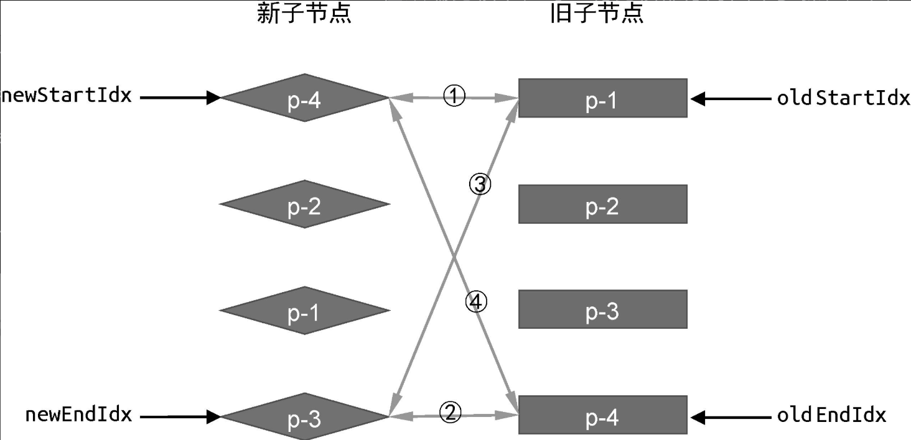

# 双端Diff


简单Difff的缺点，对DOM的移动操作 不是最优的...

双端 Diff 的基本流程：
* 4个指针，分别指向新、旧两组子节点的头、尾：oldStartIdx、oldEndIdx、newStartIdx 和 newEndIdx  
* 循环比对节点：
  * “首先”对比首尾节点：
    * 若旧首与新首匹配：复用**节点**，双首**指针**后移。
    * 若旧尾与新尾匹配：复用节点，双尾指针前移。
    * 若旧首与新尾匹配：复用节点，将旧首**节点**移到旧尾后，旧首**指针**后移，新尾指针前移。
    * 若旧尾与新首匹配：复用节点，将旧尾节点移到旧首前，旧尾指针前移，新首指针后移。
  * 若首尾均不匹配：遍历旧的子节点列表，寻找与 新首节点 拥有相同key值的元素
      - 若找到了？找到的节点移动到oldStartVNode.el之前，然后当前位置记为undefined；再更新索引啥的...
      - 若没找到？说明节点是新增的，挂载到oldStartVNode.el之前即可！
* 循环结束后，处理剩余节点，新增或删除：
  * 新节点有剩余，新增；新增范围是newStartIdx 到 newEndIdx 
  * 旧节点有剩余，删除，删除范围是oldStartIdx 到 oldEndIdx 

<br/><br/>


```
- 旧节点移动时参考的锚点，都是oldChildren的

while (oldStartIdx <= oldEndIdx && newStartIdx <= newEndIdx) {
  if (oldStartVNode.key === newStartVNode.key) {
     - 不移动，只更新索引、打补丁
  } else if (oldEndVNode.key === newEndVNode.key) {
     - 不移动，只更新索引、打补丁
  } else if (oldStartVNode.key === newEndVNode.key) {
     - 旧首移动到旧尾，并且更新索引、打补丁
  } else if (oldEndVNode.key === newStartVNode.key) {
    - 旧尾移动到旧首，并且更新索引、打补丁
      - patch(oldEndVNode, newStartVNode, container)
      - insert(oldEndVNode.el, container, oldStartVNode.el)
      - oldEndVNode = oldChildren[--oldEndIdx]
      - newStartVNode = newChildren[++newStartIdx]
  }else{
    - 遍历OldChildren，寻找与newStartVNode拥有相同key值的元素
      - 若找到了？找到的节点移动到oldStartVNode.el之前，然后当前位置记为undefined；再更新索引啥的...
      - 若没找到？说明节点是新增的，挂载到oldStartVNode.el之前即可！
  }
}

- while循环外之后，可能出现的情况：newChildren有剩余？oldChildren有剩余？

- newChildren有剩余，newStartIdx 到 newEndIdx区间内的节点需要新增、挂载... 锚点是oldStartVNode.el
if(oldStartIdx > oldEndIdx && newStartIdx <= newEndIdx){ }

- oldChildren有剩余，删除oldStartIdx至oldEndIdx的节点
else if(newStartIdx > newEndIdx && oldStartIdx <= oldEndIdx)
```
